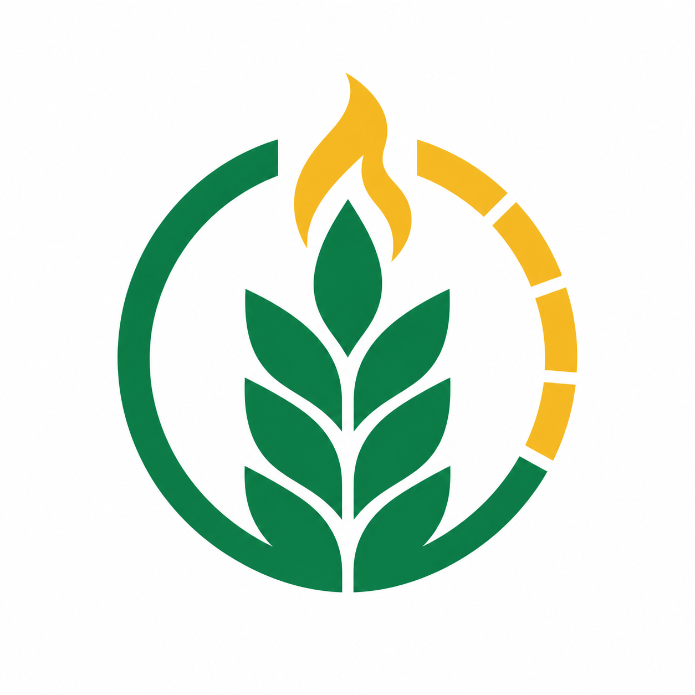
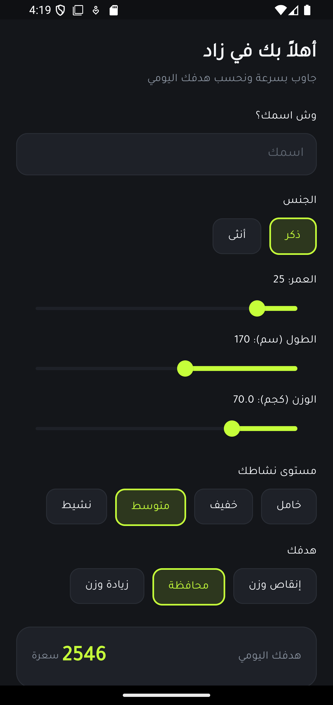
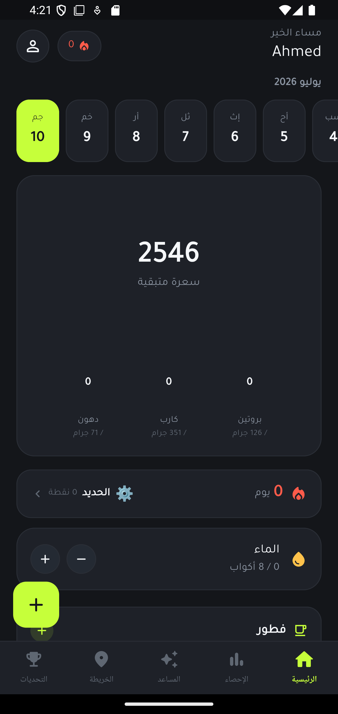
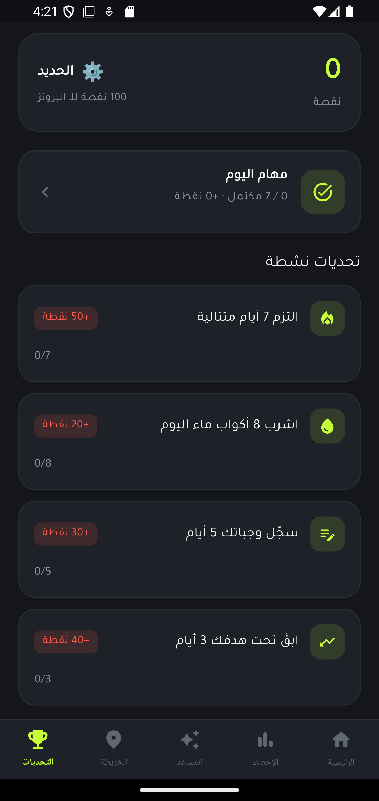
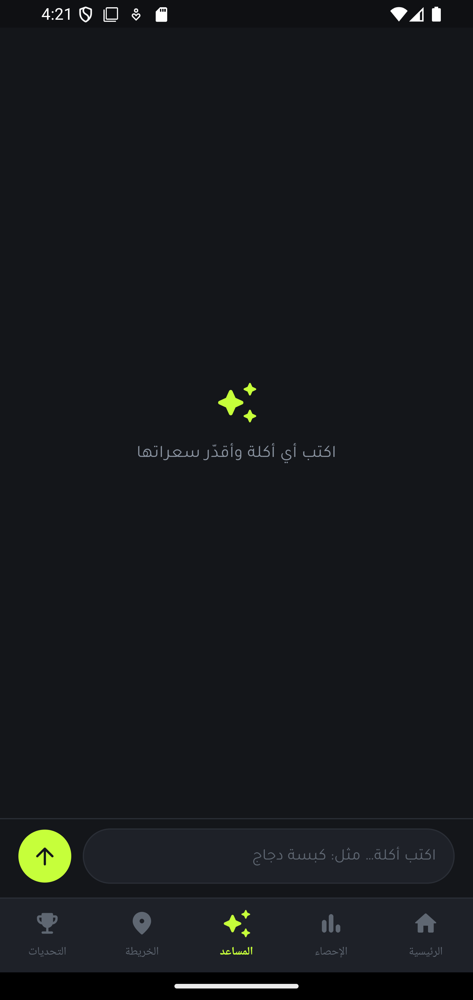
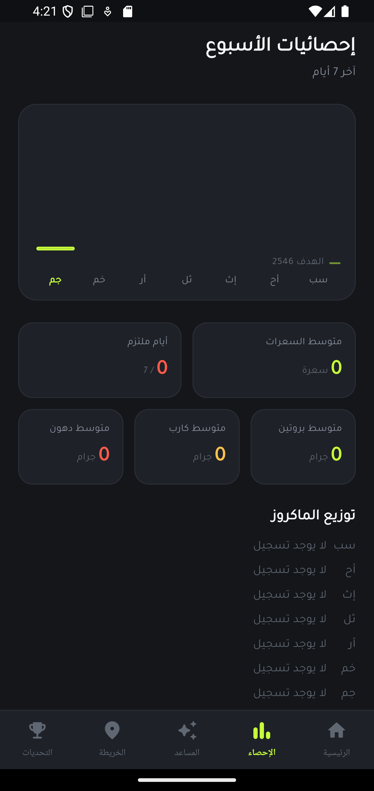

<div align="center">



# زاد — Zad

**تطبيق سعرات وتغذية ولياقة مبني للمستخدم الخليجي — أطباقنا، لغتنا، وذكاء يفهمنا**

*Calories, nutrition & fitness tracker built for the Gulf — verified local dishes, Arabic-first, AI-powered*

[](https://flutter.dev)
[](https://firebase.google.com)
[]()
[]()

</div>

---

## 💡 ليش زاد؟

تطبيقات السعرات العالمية ما تعرف الكبسة من الجريش — تخمّن وتغلط. وزاد مبني من الصفر على ثلاث ركائز:

1. **قاعدة أطباق خليجية موثّقة** — قيم غذائية مدقّقة من مصادر معتمدة، مو تخمين AI
2. **عربي أولاً** — واجهة RTL أصيلة بخط Tajawal، مو ترجمة ملصوقة
3. **الدقة قبل الإبهار** — كل قيمة تقديرية تُوسم "تقديري" بشفافية كاملة

## 📱 الشاشات

| | | |
|:---:|:---:|:---:|
|  |  |  |
| الإعداد الأولي — حساب حي للهدف | الرئيسية — حلقة السعرات والماكروز | التحديات — نقاط ورانكات حقيقية |

| | |
|:---:|:---:|
|  |  |
| المساعد الذكي — قاعدة أولاً ثم AI | الإحصائيات — آخر 7 أيام من Firestore |

## ✨ المميزات (26+)

### التغذية
- 🍛 **قاعدة أطباق خليجية موثّقة** — كبسة، مندي، جريش... قيم لكل 100g + حصة نموذجية + مصدر وثقة
- 🤖 **مساعد ذكي** — اكتب "صحن كبسة ونص" → سعرات وماكروز فورية (قاعدة أولاً، AI احتياطي موسوم "تقديري")
- 📷 **ماسح باركود** — أي منتج سوبرماركت عبر Open Food Facts
- 🔍 **بحث عالمي** — ملايين المنتجات مع debounce ذكي
- 📅 **خطة وجبات أسبوعية** + قائمة تسوق تُبنى تلقائياً
- 🍽️ **تسجيل بالسحب للحذف** مع تراجع — إحساس iOS كامل

### التحفيز
- 🔥 **ستريك حقيقي** — يُحسب من سجل Firestore الفعلي
- ⚡ **مهام يومية** بنقاط + **8 رانكات** من الحديد للبطل الأكبر
- 🏆 **تحديات ديناميكية** — تتقدم من بياناتك الحقيقية (ماء، وجبات، التزام)

### الجسم والتدريب
- ⚖️ تتبّع وزن مع sparkline + قياسات جسم (6 مواضع)
- 📐 نسبة دهون بمعادلة البحرية الأمريكية + BMI
- 📸 صور تقدّم (محلية 100%)
- 💪 مكتبة تمارين (8 مجموعات عضلية) + 3 برامج تدريب جاهزة
- 🔄 حاسبة العودة بعد الانقطاع (مبنية على أبحاث detraining)
- 🧠 محلّل أداء التمارين بالـ AI

### التجربة
- 🎨 **4 ثيمات** قابلة للتبديل الحي (Energy / Luxe / Clean / Gulf)
- 🌐 عربي/إنجليزي بتبديل فوري + RTL/LTR تلقائي
- 💧 تذكيرات ماء + 📊 تقويم شهري + إحصائيات أسبوعية

## 🏗️ البنية

```
Flutter (Dart)
│
├── State: Provider + ChangeNotifier (ProxyProvider للتبعيات)
├── Firebase: Anonymous Auth + Firestore (سجل الوجبات، streak حقيقي)
├── AI Router: Groq (llama-3.3-70b) نص · Gemini رؤية — يختار المتاح تلقائياً
├── محلي: SharedPreferences (وزن، ماء، نقاط، خطة، قياسات)
└── Theme: ThemeExtension tokens — صفر ألوان ثابتة بالواجهات
```

**قرارات تصميم:**
- **لا مفاتيح في الكود** — كل المفاتيح عبر `--dart-define`
- **بلا حساب، بلا بريد** — مصادقة مجهولة، خصوصية كاملة
- **القاعدة الموثّقة أولاً** — الـ AI احتياطي موسوم، مو مصدر أساسي
- **حواجز أمان بالـ prompts** — لا نصائح طبية، حماية من اضطرابات الأكل

## 🚀 التشغيل

```bash
flutter pub get

# تطوير
flutter run --dart-define=GROQ_API_KEY=<مفتاحك من console.groq.com>

# إنتاج (التوقيع عبر android/key.properties — غير مرفوع)
flutter build appbundle --dart-define=GROQ_API_KEY=<مفتاحك>
```

## 🧪 الجودة

```
flutter analyze → 0 issues
flutter test    → 17 tests passing
```

---

<div align="center">

**زاد — كل شيء تحتاجه لرحلتك، بلغتك** 🌾

</div>
